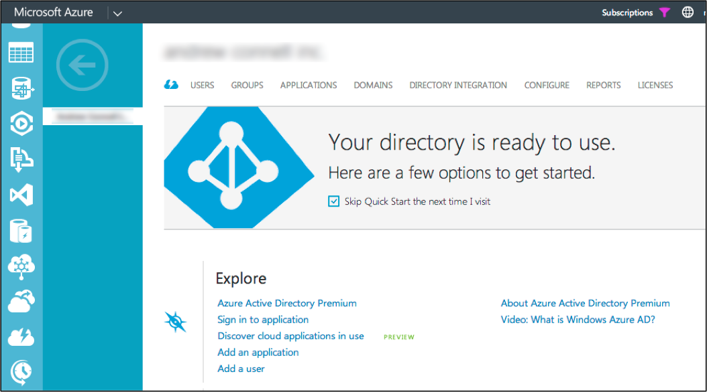
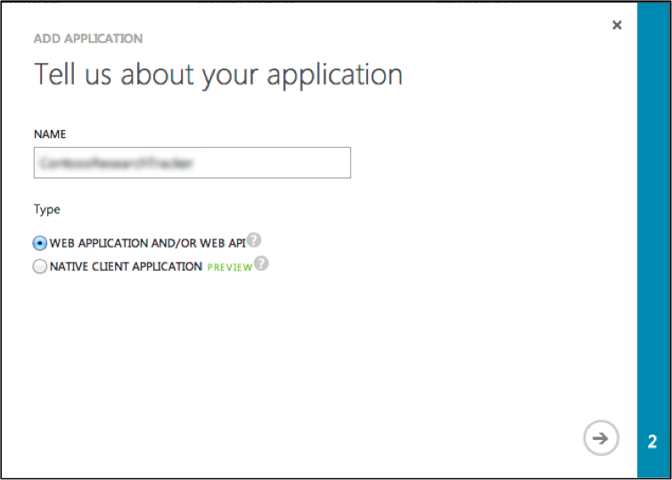
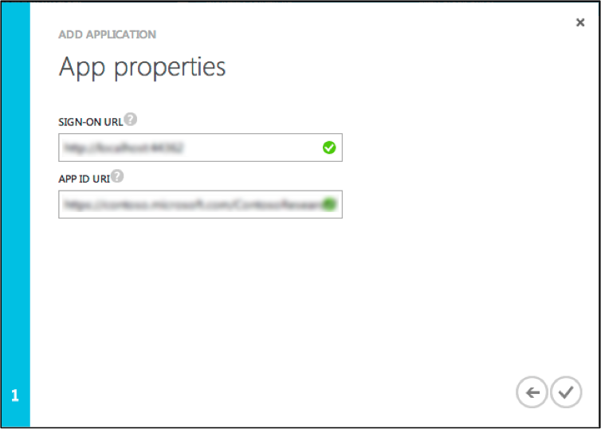

Project Research Tracker SPA – Sample Setup
===========
This document explains the steps required in order to run the Project Research Tracker reference application.
This project is based on the [project](https://github.com/OfficeDev/Research-Project-Code-Sample/tree/master/src/SpResearchTracker) by Jeremy Thake, but instead of using the SharePoint REST APIs, I'm using the SharePoint Client Side Object Model (CSOM).

##Prerequisites
The following things are required in order to run this sample:
- You must have an Azure subscription
- You must have an Office 365 tenant
    - This sample is designed to work with SharePoint Online & Office 365 only; it does not work with an on-premises SharePoint 2013 deployment
- The directory used in your Office 365 tenant must be linked to your Azure subscription
- Your Office 365 tenant must have SharePoint site collection
- The user you that you will login & test the reference application with must have the following permissions in the SharePoint site collection
    - Create lists
    - Create, edit, delete and read items in lists

##Configure the Microsoft Azure Subscription
The reference application is configured as an app in Microsoft Azure Active Directory (AAD). This AAD app is granted permissions to SharePoint Online (SPO) in Office 365 (O365) to create lists, as well as read and edit items in these lists.

In order to run the sample application, you must first create and then configure an app in AAD. During these processes, you need to make note of a few values and settings as the will be needed later in the setup process. Use the following table to keep track of these settings:

Setting | Example
--- | ---
**ASP.NET Web Application** | https://localhost:44362
**Office 365 Tenant ID** | contoso
**Office 365 Tenant ID URL** | contoso.onmicrosoft.com
**Azure AD App Name** | ContosoResearchTracker
**Azure AD App ID URL Name** | https://contoso.onmicrosoft.com/ContosoResearchTracker
**Azure AD App Client ID** | C78b2619-86a7-4c27-c99a-e0e34dcbf341
**Azure AD App Key** | VnXElqNkFP+Cl1mo0KWOytae8NxzKmrgFOObTz2YpEE=
**Fully Qualified SharePoint Online Resource** | https://contoso.sharepoint.com
**Fully Qualified URL of the SharePoint Site** | https://contoso.sharepoint.com/sites/ContosoResearchTracker/

First, login to the Azure Management Portal (https://manage.windowsazure.com).
##Create Azure Active Directory App
In the Azure Management Portal, select **Active Directory** from the left-margin menu. Select the linked Azure AD directory that is used by your Office 365 tenant and from the directory’s dashboard, select the **APPLICATIONS** option in the top-navigation:

In the wizard titled **What do you want to do?** that appears, select **Add an application my organization is developing**.

Next, enter the **Name** for the application, record it in the table above as the **Azure AD App Name** and for the **Type** select **Web Application And/Or Web API**:

The next page in the wizard titled **App Properties** contains two very important properties that you must remember, so make sure you reference the table above.

The **Sign-On URL** property is the URL where the ASP.NET application will reside, listed as the **ASP.NET Web Application** in the table above.

The **App ID URI** is the unique identifier of the app, listed as **Azure AD App ID URL Name** in the table above.

When finished, click the CHECK icon in the lower right to create the new Azure AD application.

##Configure Azure Active Directory App
After creating the Azure AD application you then need to make some configuration changes to the app. If it is not already selected in the Azure Management Portal, do so now. From the application’s dashboard page, click the **CONFIGURE** link the top navigation.

Within the **Properties** section, scroll down to the **Client ID** property. Copy the value of the **Client ID** as you will need this when configuring the ASP.NET web application:

Next scroll down to the **Keys** section. Currently the app does not have any keys assigned to it so you need to create one. First using the selector, select the duration for the key of either one or two years. Notice that after selecting the duration you must first save the configuration changes in order to get the key so click the Save button in the footer of the Azure Management Portal.

Once the save process completes, you will see that the key is displayed along with a message saying you need to copy the key as it will not be visible again. This is important… make sure you copy the key to a safe place. If you leave this page and come back, the key will not be shown and if you did not copy it, you will be forced to create a new key. In the table above, the key is the **Azure AD App Key**.

Now you need to grant the Azure AD application permissions to Office 365. Scroll to the section **Permissions to Other Applications**. Using the selector, pick the option **Office 365 SharePoint Online**. On the same line, select the **Delegated Permissions: 0** selector and select the following options:
-	Create or delete items and lists in all site collections
-	Edit or delete items in all site collections
-	Read items in all site collections

Next, update the **Reply Url** to include additional links as shown in the following image:

 

Save your changes.

Save your changes. At this point the Azure AD application has been created and configured. The next step is to update the ASP.NET Web application.

#Configure the ASP.NET Web Application
In order for the ASP.NET Web application to run, it must be configured to use the app that was created in AAD in the previous setup.  Once the changes have been performed, the sample ASP.NET Web application can be either deployed to an Azure Web Site to test, or it can be launched from Visual Studio in Debug mode.

All the changes can be done in the **[SpResearchTracker](../SpResearchTracker)** project’s `web.config`. Use the values you filled out in the table above to make the following changes:

##Line 21 – App Setting “ida:SiteURL”
Update the value with the **Fully Qualified URL of the SharePoint Site**.
##Line 26 – App Setting “ida:Resource”
Update the value with the **Fully Qualified SharePoint Online Resource**.
##Line 27 – App Setting “ida:ClientID”
Update the value with the **Azure AD App Client ID**.
##Line 28 – App Setting “ida:AppKey”
Update the value with the **Azure AD App Key**.

